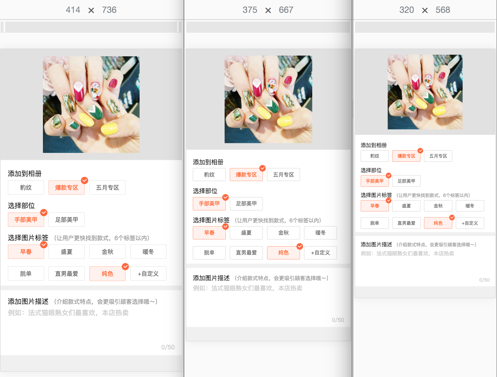

一般我们在做前端项目之前，都会先拿到视觉稿和交互稿，我们可以根据视觉稿上的尺寸、颜色等信息编写CSS样式，可以根据交互稿来写JS。

每个公司的视觉规范不同，视觉稿也就不同。甚至在一些大公司里，每个部门都有自己的视觉规范。比如页面画布大小是以640为基准还是750。最终给前端开发人员的文件也可能不同，比如psd文件、sketch文件或者图片文件，其中包括页面文件和切图。

我做过的项目里，有这几种情况：

- sketch文件包 + 总体设计图 + 每个页面图片 + 切图(@2x、@3x各一份)
- psd源文件 + 总体设计图 + 每个页面图片（有的带尺寸/颜色标注） + 切图(@2x、@3x各一份)
- 只给带标注的图片的，这种我都会问UED要源文件，标注很难画全的。

我们ued画布基准都是iphone6，但是有的是给的画布宽375的sketch文件，有的给画布宽750的psd文件。

下面以我做过的一个页面为例，左边是sketch文件的截图，右边是psd文件导出的图片。

<div>
&nbsp;&nbsp;&nbsp;

<div> 

这个页面涉及到了移动端适配的几个问题:


- 布局适配，不同屏幕尺寸的设备中布局一致
- 图片高清适配，不同分辨率设备中图片高清展示
- 不同分辨率设备中1px边框显示一致
- 内容适配，不同屏幕尺寸的设备中的文字大小

那，拿到视觉稿了，我们要开始写代码了。

**假如我们拿到的是宽750的视觉稿**

在写css代码前还得做件事儿，手机端布局视口默认情况下是768px ~ 1024px之间，手机屏幕宽度大家知道的iphone5 320px, iphone6 375px, iphone6 plus 414px这样子。

像下面图示这样，在手机上浏览页面时得横向滚动，是不是很不友好？
<div align="center">
	
</div>


所以我们得想办法，让页面横向内容都展示在屏幕可视范围中，并且禁止缩放。有两种办法：

### 1、 设置布局视口宽度为一个定值，然后按照布局视口的宽度与屏幕宽度的比例缩放

  比如屏幕宽375px，视觉稿750px，那就设置布局视口的宽度width=750，
  scale = 375 / 750 = 0.5
  
```xml
<meta name="viewport" content="width=750,initial-scale=0.5,maximum-scale=0.5,user-scalable=no">
```
  
  再比如屏幕宽320px，视觉稿750px，那就设置布局视口的宽度width=750，
  scale = 320 / 750 
  
当然这是需要根据屏幕宽度动态设置的:

```javascript
(function(){
	var doc = window.document;
	var metaEl = doc.querySelector('meta[name="viewport"]');
	if(!metaEl){
		metaEl = doc.createElement("meta");
		metaEl.setAttribute("name", "viewport");
	}
	var metaCtt = metaEl ? metaEl.content : '';
	var matchWidth = metaCtt.match(/width=([^,\s]+)/);
	var width = matchWidth ? matchWidth[1] : 750
	if(width == 'device-width'){return}
	
	var screenWidth = window.screen.width;
	var scale = screenWidth/width;
	metaEl.setAttribute("content", "width="+ width +",user-scalable=no,initial-scale=" + scale + ",maximum-scale=" + scale + ",minimum-scale=" + scale);
})()
```

[demo1](http://chang20159.com/mobile-web-adaptive/demo1/demo1.html)		

下面是依次在iphone6 plus，iphone6，iphone5上的展示效果。


**那有人就会问啦，给的视觉稿是基于iphone5的，画布宽度640怎么办？**

那css编程就按照视觉给的来，width设置640，在宽640的布局视口，CSS样式编写与视觉稿相同，那布局就能与视觉稿相同啦。再通过动态缩放就能把整个页面完整的展示在可视窗口中啦。

**那又有人问啦，给的不是750宽的视觉稿，是sketch视觉稿，宽375，这怎么办？**

一样的道理，视觉稿宽375，视觉稿中的元素都是按宽375来布局的，那我们布局视口width设置375，css样式按375的视觉稿来写就好啦，最后就是动态缩放啦。

好啦，那我们来看这种方式能不能解决我们遇到的几个问题。
- 图片高清问题

  实际要解决的是怎么让1个位图像素正好覆盖1个物理像素，这样可以让图片在不同dpr的手机上效果一样。
 
  - dpr = 1，需要1倍图
  - dpr = 2，需要2倍图
  - dpr = 3，需要3倍图

  最好的解决办法是：不同的dpr下，加载不同的尺寸的图片

- 1px边框问题
	
	实际要解决的是怎么让1个css像素正好覆盖1个物理像素，这样可以让1px边框在不同dpr的手机上一样细。
	
	但是布局视口缩放比为 1/dpr 才能让1个css像素是否正好覆盖1个物理像素。
	显然这种按照布局视口的宽度与屏幕宽度的比例缩放的方式，只有与视觉稿画布基准一致的设备才能与视觉稿要求显示的一致。比如这里只有在iphone6上1个css像素是否正好覆盖1个物理像素（横向200px的元素对应400个物理像素，在缩放0.5后，横向200px的元素对应200个物理像素，1:1）
	
	
- 布局适配的问题

	其实直接从上面的对比图就可以看出来，在不同设备上布局是一致的。	
	原理很简单： 我们写CSS本来就是按视觉稿来写的，然后整体缩放，以适应各种宽度的设备，元素的比例没有变。


- 内容适配的问题
 
  主要是文字大小，因为是整体缩放，屏幕越大，字体也越大。
  
  这个主要看视觉规范怎么定，有的觉得这样挺好，有的就希望字体大小都一样，还有的希望字体大小不是根据屏幕大小按比例缩放而是对一定范围内的屏幕宽度设定特定的字体大小。


#### 总结

	【原理】设定布局视口宽度为视觉稿画布宽度，动态设置缩放比例scale=屏幕宽度/视觉稿画布宽度
	【优点】实现简单，可解决不同屏幕大小的布局问题，在各种屏幕上布局一致
	【缺点】
		- 不能解决1px边框问题；
		- 缩放值依赖于屏幕宽度，demo里是通过screen.width获取屏幕宽度的，这在chrome里iphone6返回的是屏幕宽度值375，但在其他浏览器就不一定了，比如safari中返回的是1280。
		- 所有元素都会缩放，比如字体，在iphone5上就会小很多，这不一定是大家想要的。

### 2、 设置布局视口的宽度 = 设备宽度

```xml
<meta name="viewport" content="width=device-width,initial-scale=1,maximum-scale=1,user-scalable=no">
```
这种情况下有什么效果呢？

[demo2](http://chang20159.com/mobile-web-adaptive/demo2/demo2.html)

图片太长，横着放了^^


看看看，都被挤掉了，为啥？	
这个是iphone6的截图，现在设置了布局视口宽度是屏幕宽度375，我们视觉稿是按iphone6来的宽750，那当然就放不下了，比如视觉稿中图片占位400px x 400px，我们CSS中写的：

```css
img{
	width: 400px;
	height: 400px;
}
```
但是布局视口宽度就375，图片就放不下了。

那iphone6布局视口宽只有375，我们把视觉稿尺寸全部按比例缩小到375就好啦。那750到375，需要除以2，我们在编写css样式时除以2就好啦。

上面视觉稿中图片是400 x 400，我们CSS中就写：

```css
img{
	width: 200px;
	height: 200px;
}
```

其他元素的宽高、边框、内边距、外边距、字体大小等，通通先除以2，通通先除以2。那现在的效果是这样的，依次是iphone6 plus，iphone6, iphone5


现在，我们能看到100%呈现在可视窗口中了。那再来看看我们遇到的问题解决了吗？

- 1px边框问题

	设置0.5px，在dpr=2的设备中对应1个物理像素，在dpr=2的设备中对应1.5个物理像素。
	而且在dpr=2的设备中设置0.5px不一定能达到我们想要的效果，看下面：
	
	
	
	明明设置的0.5px，但浏览器实际还是按1px处理的。ios7以下，android等其他系统里，0.5px会被当成为0px处理？
	
	所以直接设置成0.5px是不可行的。
	
	这实际上还是需要1个css像素正好覆盖1个物理像素就可以解决的。
  
- 布局适配的问题
  
  因为没有按设备属性动态缩放，每个设备上每个css像素大小都一样，200px大小的元素在每个设备上也够一样长。		
  
  其实从上面的对比图就能看出来，图片容器（灰色背景）在不同屏幕大小的手机都是一样的高，整个页面在小屏手机中就需要向下滚动查看，一排展示的4个图片标签在大屏手机中右边的空白就比较大。布局问题也没有解决。
- 内容适配的问题
	
	文字大小统统一样，也没有解决。
	
#### 2.1、让1个css像素只占1个物理像素

前面已经讲了几遍了，要解决图片高清和1px边框的问题，达到在不同分辨率设备上效果一致（当然也与视觉稿一致），需要让不同分辨率设备上 **1个css像素只覆盖一个物理像素**。

前面我们将750视觉稿中的尺寸除以2来编写样式，只能在iphone6上的效果满足。那现在我们在布局宽度=屏幕宽度时，让缩放比例为 1/dpr，就可以让**1个css像素只覆盖一个物理像素**。


比如750的视觉稿，元素边框1px，我们CSS样式也写：

```css
div{
	border-width: 1px;
}
```

然后js动态设置缩放逻辑大概是这样子，[手淘flexible方案](https://github.com/amfe/lib-flexible) 对于dpr>=3的都按3处理，其他设备(安卓)都按1倍处理。

```javascript
var doc = document;
var docEl = document.documentElement;
var isIos = navigator.appVersion.match(/(iphone|ipad|ipod)/gi);
var dpr = window.devicePixelRatio || 1;
if (!isIos){ dpr = 1 }
var scale = 1 / dpr;
var metaEl = doc.querySelector('meta[name="viewport"]');
if (!metaEl) {
    metaEl = doc.createElement("meta");
    metaEl.setAttribute("name", "viewport");
    doc.head.appendChild(metaEl)
}
metaEl.setAttribute("content", "width=device-width,user-scalable=no,initial-scale=" + scale + ",maximum-scale=" + scale + ",minimum-scale=" + scale);
```
那现在无论什么分辨率的设备，1个css像素实际只占1个物理像素了。

那现在效果是什么样子呢？

[demo3](http://chang20159.com/mobile-web-adaptive/demo3/demo3.html)


所有元素尺寸都缩小1/dpr了，本质上是一个css像素缩小了1/dpr，不同dpr的设备上css像素大小就不同了。那我们css样式200px，在不同dpr的设备上所占宽度也不同了。

**注意： 如果在安卓设备上查看demo3，与demo2的效果相同，因为dpr=1，没有缩放，css样式又与750视觉稿一致。所以这种方式只缩放，不控制布局视不行的。**

这个问题可以在待会讲布局适配时解决，布局适配的目的是让元素在不同设备上占比一致（与视觉稿相同。）


#### 2.2、解决布局适配问题


可以看下demo3的图

- 不同屏幕大小的手机都是一样的高，在小屏手机中就需要向下滚动查看。
- 选择图片标签下一行展示4个，但在大屏手机中右边的空白就比较大。

那我们希望，元素在布局视口中的占比（包括元素宽高、边距等）在不同设备上都相同

同一份样式怎么让元素占比相同呢？用绝对单位px肯定是不行的，我们考虑相对单位rem。

假如有个宽可以表示为20rem的元素：

|css样式|css像素个数|
|:--|:--|
|width:20rem|20 * html元素的font-size|

```
元素占比 = 元素css像素个数 ／ 布局视口宽度
        = 20 * html元素的font-size / 布局视口宽度
```
所以只要满足：

```
常量值 *  html元素的font-size =  布局视口宽度
```
元素占比在任何设备上都是某一个定值了。

那我们只要按下面的公式动态设置html元素的font-size就好啦。

```
html元素的font-size = 布局视口宽度 ／ 常量值
```

这个常量值可以是任意一个常数，但为了写样式方便，我们会做这样的考虑：


我们用的视觉稿 iphone6，在缩放比例为1时，布局视口宽度=375，如果取这个常量值为 3.75，

iphone6中html元素的font-size = 375 ／ 3.75 = 100

但这时视觉稿中200px的元素对应的宽是750，而页面布局宽375，那我们需要先讲视觉稿中的200px除以2，再除以100，得到 1rem.

其实在缩放比例为1时，iphone6中html元素的font-size = 375 ／ 7 = 50，我们直接用视觉稿中的200px除以50，得到2rem就好了


如果像前面那样为了解决retina屏显示的问题 缩放了1/dpr,iphone6布局视口的宽度就是：375 * 2 个css像素

iphone6中html元素的font-size = 375 * 2 ／ 7.5 = 100

对于以iphone6为基准的视觉稿，并且缩放1/dpr,html元素的font-size 与 布局视口宽度视口的比例可以

```
html元素的font-size = 布局视口宽度 / 7.5
```
对于以iphone5为基准的视觉稿，并且缩放1/dpr

```
html元素的font-size = 布局视口宽度 / 6.4
```
大概的实现就是这样子：

```javascript
var doc = document;
var docEl = document.documentElement;
var isIos = navigator.appVersion.match(/(iphone|ipad|ipod)/gi);
var dpr = window.devicePixelRatio || 1;
if (!isIos){ dpr = 1 }
var scale = 1 / dpr;
var metaEl = doc.querySelector('meta[name="viewport"]');
if (!metaEl) {
    metaEl = doc.createElement("meta");
    metaEl.setAttribute("name", "viewport");
    doc.head.appendChild(metaEl)
}
metaEl.setAttribute("content", "width=device-width,user-scalable=no,initial-scale=" + scale + ",maximum-scale=" + scale + ",minimum-scale=" + scale);
setTimeout(function(){
	var width = docEl.getBoundingClientRect().width;
	docEl.style.fontSize = width / 7.5 + 'px';
})
```

最后的效果是： 

[demo4](http://chang20159.com/mobile-web-adaptive/demo4/demo4.html)

[demo5](http://chang20159.com/mobile-web-adaptive/demo5/demo5.html)



#### 总结

1、 设置html元素的font-size与布局视口宽度成比例，css样式使用相对单位rem，元素尺寸也就与布局视口宽度成比例，从而在每个设备布局一致。用视觉稿来确定这个比例值就能与视觉稿的布局一致。

2、 设置缩放比例为 1/dpr可以解决 1px边框 和图片高清的问题。
 
 
 
为了rem与px换算方便，选定的比例值可以让html元素的font-size为100px。
iphone6就是7.5，iphone5就是6.4，不同基准的视觉稿rem与px换算比例都是100. 

最后，如果不想动态适配的内容，可以直接使用px单位，比如字体，还有1px边框。

### 淘宝和网易的做法
这里讲的适配方案是今天[2017-08-11]的，以后网站方案可能会有改动，所以我把代码保存下来了，可以看**适配代码**

**1、 手机淘宝**

[网站](https://m.taobao.com/#index)
[适配代码](./lib/taobao_flexible.js)

淘宝统一定为10，iphone6是 1rem = 75px，iphone5 1rem = 64px,可以到https://m.taobao.com/#index验证。不同基准的视觉稿rem与px换算比例不同。

**2、 网易**

[网站](http://3g.163.com/)
[适配代码](./lib/wangyi_adaptive.js)

并没有做缩放，只使用了相对单位rem。

```
html的font-size = 布局视口宽度/7.5 = 设备屏幕宽度 / 7.5
```
在iphone上，html的font-size为 375/7.5 = 50px

这个比例可以随便设置，根据实际的需求，网易设置7.5时考虑换算简单，淘宝则是考虑兼容vw。


